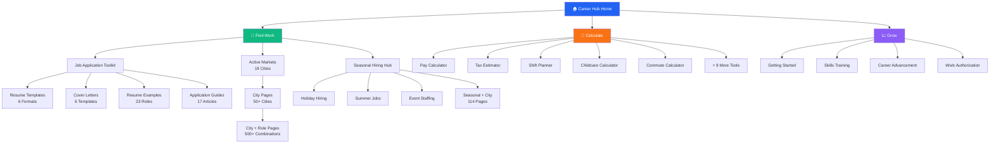

<div align="center">

# 🚀 Indeed Flex Career Hub

**A career resource website designed to help US flexible workers find jobs and grow their careers**

[](https://flex-career-compass.lovable.app)

[View Live Site →](https://flex-career-compass.lovable.app)

</div>

---

## 🗺️ Site Architecture



**How Pages Connect:**
- **Home** links to all three pillars
- **Pillars** link to their sub-hubs
- **Sub-hubs** link to individual content pages
- **Every page** links back up and to related content

---

## 📋 What Is This Project?

The **Indeed Flex Career Hub** is a website that helps people who are looking for temporary or flexible work. It provides:

- **Job application resources** — Resume templates, cover letters, and interview guides
- **Financial calculators** — Tools to estimate pay, taxes, and childcare costs
- **Location guides** — Information about job markets in 19+ US cities
- **Career guides** — Tips for getting hired and advancing your career

### Who Is This For?

| Audience | How It Helps |
|----------|--------------|
| **Job seekers** | Resume templates, interview prep, job search tips |
| **Students** | Part-time work guides, flexible scheduling advice |
| **Career changers** | Transferable skills guides, industry overviews |
| **Current gig workers** | Pay calculators, tax estimators, career growth paths |

---

## 🗂️ Site Structure Overview

The website is organized into **three main sections** based on what users want to do:

### 1. 📝 Find Work (Job Application Resources)

The **Job Application Toolkit** (`/career-hub/job-application-toolkit`) is the central hub for all job search resources:

| Resource Type | What's Included |
|--------------|-----------------|
| **Resume Templates** | 6 formats (modern, professional, simple, ATS-friendly, creative, entry-level) |
| **Cover Letter Templates** | 6 templates for different industries |
| **Resume Examples** | 23 role-specific examples with real content |
| **Guides** | 17 in-depth articles covering resumes, interviews, and job platforms |

**Key Article Categories:**
- For Students & Freshers (4 guides)
- Compare Your Options (3 comparison guides)
- Interview Prep (4 industry-specific guides)
- Industry Resume Guides (6 detailed guides)

### 2. 🧮 Calculate (Financial Tools)

Interactive calculators to help workers plan their finances:

| Tool | What It Does |
|------|-------------|
| **Pay Calculator** | Estimates take-home pay after taxes |
| **Tax Estimator** | Calculates quarterly tax payments |
| **Shift Planner** | Projects weekly/monthly earnings |
| **Childcare Calculator** | Shows break-even analysis for working parents |
| **Commute Calculator** | Calculates true cost of commuting |
| **Unemployment Calculator** | Estimates state benefits |
| **Cost of Living** | Compares expenses between cities |

### 3. 📈 Grow (Career Development)

Resources for career growth and skill building:

| Category | Content |
|----------|---------|
| **Getting Started** | First job guides, platform tutorials |
| **Career Growth** | Promotion paths, skill development |
| **Industry Guides** | Warehouse, hospitality, retail, facilities |
| **Employment Eligibility** | I-9 guides, work authorization info |
| **Seasonal Hiring** | Holiday jobs, summer work, event staffing |

---

## 🎯 Strategy: How the Site Attracts Visitors

### Search Engine Optimization (SEO)

The site is designed to appear in Google search results for job-related searches:

**Target Searches Include:**
- "warehouse resume template"
- "how to write a resume with no experience"
- "indeed flex reviews"
- "temp jobs in [city]"
- "holiday warehouse jobs 2026"

### Page Count

The site generates **1,700+ unique pages** through smart combinations:

| Page Type | Example | Count |
|-----------|---------|-------|
| City guides | Jobs in Austin, TX | 50+ |
| Role guides | Warehouse Worker resume | 20+ |
| City + Role | Warehouse jobs in Austin | 500+ |
| Seasonal + City | Summer jobs in Chicago | 114 |
| Articles | Fresher resume guide | 50+ |

### The "Job Application Toolkit" Strategy

This page consolidates all resume and job application resources in one place, making it:
- **Easy for visitors** to find everything they need
- **Good for search engines** by creating a strong "hub" page
- **Efficient for sharing** — one link covers all job search resources

---

## 📂 Folder Structure (For Contributors)

```
src/
├── pages/career-hub/
│   ├── JobApplicationToolkitPage.tsx  ← Main job application hub
│   ├── tools/                         ← 14 financial calculators
│   ├── articles/                      ← Guide article pages
│   └── programmatic/                  ← Auto-generated location pages
├── data/
│   ├── articles/
│   │   ├── guides.ts                  ← Career growth articles
│   │   ├── job-application-articles.ts ← Resume & interview articles
│   │   └── seasonal-location-data.ts  ← City-specific seasonal data
│   ├── resume-templates.ts            ← 6 resume format templates
│   ├── cover-letter-templates.ts      ← 6 cover letter templates
│   ├── resume-content.ts              ← 23 role-specific resume examples
│   ├── cities.ts                      ← 50+ US city data
│   ├── locations.ts                   ← 19 Indeed Flex markets
│   └── roles.ts                       ← 20+ job role definitions
├── components/career-hub/
│   └── [reusable page components]
└── public/
    ├── sitemap.xml                    ← Index of all site pages
    └── robots.txt                     ← Instructions for search engines
```

---

## 📊 Content Summary

| Category | Count | Location |
|----------|-------|----------|
| Resume Templates | 6 | `/career-hub/templates` |
| Cover Letter Templates | 6 | `/career-hub/cover-letters` |
| Resume Examples | 23 | `/career-hub/resume-examples` |
| Job Application Guides | 17 | `/career-hub/guides/*` |
| Career Growth Guides | 25+ | `/career-hub/guides/*` |
| Financial Tools | 14 | `/career-hub/tools/*` |
| City Guides | 50+ | `/career-hub/cities/*` |
| Seasonal Pages | 114 | `/career-hub/guides/*-{city}` |

---

## 🔗 Key Pages

| Page | URL | Purpose |
|------|-----|---------|
| **Home** | `/career-hub` | Main entry point |
| **Job Application Toolkit** | `/career-hub/job-application-toolkit` | All resume/interview resources |
| **Resume Templates** | `/career-hub/templates` | Interactive template builder |
| **Career Guides** | `/career-hub/guides` | All educational articles |
| **Financial Tools** | `/career-hub/tools` | Pay and tax calculators |
| **Active Markets** | `/career-hub/active-markets` | Indeed Flex locations |

---

## 🛠️ For Developers

### Quick Start

```bash
# Install dependencies
npm install

# Start development server
npm run dev

# Build for production
npm run build
```

### Technologies Used

- **React** — User interface framework
- **TypeScript** — Type-safe JavaScript
- **Tailwind CSS** — Styling system
- **Vite** — Fast build tool
- **Supabase** — Database and backend

---

## 📈 Success Metrics

The project is designed to achieve:

- **Search visibility** — Rank for 100+ job-related keywords
- **User engagement** — 2+ minutes average session
- **Conversion** — Drive app downloads via Indeed Flex CTAs

---

## 🤝 Contributing

See [CONTRIBUTING.md](CONTRIBUTING.md) for guidelines on:
- Adding new content
- Creating new tools
- Improving existing pages

---

## 📄 License

MIT License — see [LICENSE](LICENSE) for details.

---

<div align="center">

**Built with ❤️ using [Lovable](https://lovable.dev)**

</div>
